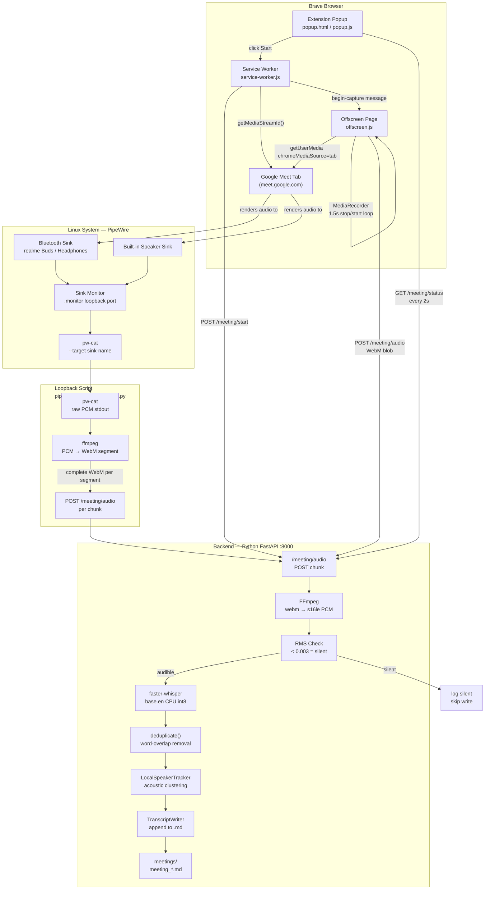

# How Google Meet Transcriber Works

## The Big Picture

Two separate capture paths feed into one backend pipeline. The output is a Markdown transcript written to disk in real time.

```
┌─────────────────────────────────────────────────────────────────────┐
│                         CAPTURE LAYER                               │
│                                                                     │
│  PATH A (Extension)          PATH B (PipeWire Loopback)            │
│  ─────────────────           ──────────────────────────            │
│  Brave Extension              pw-cat --target <sink>               │
│  tabCapture API               reads monitor of BT/speaker          │
│  + mic getUserMedia           output device                        │
│        │                             │                             │
│        └──────────────┬──────────────┘                             │
│                       │ POST /meeting/audio                         │
│               WebM chunks every 1.5s                               │
└───────────────────────┼─────────────────────────────────────────────┘
                        │
┌───────────────────────▼─────────────────────────────────────────────┐
│                      BACKEND PIPELINE                               │
│                                                                     │
│   FFmpeg decode → numpy float32 PCM → faster-whisper → text        │
│       └── RMS check ──┘                    └── dedupe ──┘           │
│                                                                     │
│   LocalSpeakerTracker → "Speaker 1 / Speaker 2"                    │
│                                                                     │
│   TranscriptWriter → meetings/meeting_YYYY-MM-DD_HH-MM-SS.md       │
└─────────────────────────────────────────────────────────────────────┘
```

---

## Architecture Diagram



---

## Component Walkthrough

### 1. Extension Popup — `extension/popup/popup.js`

The entry point for the user. When you click **Start**:

1. Calls `ensureExtensionMic()` — tries `getUserMedia({audio:true})` for 4s. This pre-warms the browser's mic permission dialog.
2. Sends `{ type: "start" }` message to the **service worker**.
3. Polls `GET /meeting/status` every 2s and updates the UI:
   - Reads the last `capture_mode:` event from the backend debug log → shows **green Tab+Mic** or **yellow Tab-only** badge
   - After 5+ silent chunks → shows a warning to run the loopback script

---

### 2. Service Worker — `extension/background/service-worker.js`

The coordinator. On receiving `"start"`:

```
1. GET /health          → confirm backend is up
2. GET /config          → get chunk duration (1500ms)
3. POST /meeting/start  → backend creates the .md file, returns its name
4. resetOffscreen()     → close any stale offscreen doc, create a fresh one
5. waitForOffscreen()   → ping the offscreen page every 50ms until it responds
6. getMediaStreamId()   → ask Chrome for a stream ID tied to the Meet tab
7. send "begin-capture" → pass the stream ID + chunk duration to offscreen.js
8. store active=true    → in chrome.storage.local
```

If anything in steps 4–7 fails → calls `POST /meeting/stop` to clean up the backend session before throwing.

---

### 3. Offscreen Page — `extension/offscreen/offscreen.js`

This is where actual audio capture happens. It runs in a hidden Chrome document with access to media APIs.

**`buildCaptureStream(streamId)`** — called once on start:

```
tabStream  = getUserMedia({ chromeMediaSource: "tab", streamId })
                 ↓ captures rendered tab audio (remote voices)

micStream  = tryGetMicStream()   ← 3 strategies tried in order:
   Strategy 1: standard getUserMedia with APM
   Strategy 2: getUserMedia without echoCancellation (avoids WebRTC conflict)
   Strategy 3: enumerate devices → try each by deviceId explicitly

AudioContext:
   tabSource  ──→ recordDestination  (goes to recorder)
   tabSource  ──→ audioContext.destination  (keeps meeting audio audible)
   micSource  ──→ recordDestination  (merged if mic was granted)
```

**`runCaptureLoop(timesliceMs)`** — runs every 1.5s:

```
while (active):
    recorder = new MediaRecorder(recordStream)
    recorder.start()
    wait 1500ms
    recorder.stop()           ← each stop produces a COMPLETE WebM file
    blob = new Blob(parts)
    POST /meeting/audio (blob)
```

> **Why stop/start instead of continuous?**
> `MediaRecorder` with `timeslice` produces **fragmented WebM** — chunks 2+ are missing the EBML header and FFmpeg can't decode them. Stop/start produces a **complete, self-contained WebM** every time.

---

### 4. PipeWire Loopback — `backend/scripts/pipewire_loopback_capture.py`

The alternative capture path that bypasses all browser permission issues.

**Sink auto-detection** via `pw-dump`:
```
All PipeWire nodes → filter Audio/Sink → score each:
  bluez (Bluetooth)  +30   ← your earphones/headphones
  speaker/headphone  +10
  HDMI/DisplayPort    -5
→ pick highest score
```

**Capture pipeline**:
```
pw-cat --record --target <sink-name> --format s16 --rate 48000
    │  (raw PCM on stdout)
    ▼
ffmpeg -f s16le -i pipe:0
       -f segment -segment_time 1.5
       -c:a libopus -b:a 64k
       chunk_%05d.webm
    │
    ▼  (completed segment files)
POST /meeting/audio (WebM blob)
```

**Upload loop** — parallel to ffmpeg:
```
watch temp dir for completed chunks
  skip the highest-index file (ffmpeg still writing it)
  read blob → POST /meeting/audio → delete file
```

---

### 5. Backend API — `backend/app/main.py`

Four routes that matter:

| Route | What it does |
|-------|-------------|
| `POST /meeting/start` | Creates `meeting_YYYY-MM-DD_HH-MM-SS.md`, sets `active=True` |
| `POST /meeting/audio` | Receives a WebM blob, calls `service.ingest()` |
| `POST /meeting/stop` | Flushes the writer, sets `active=False` |
| `GET /meeting/status` | Returns live metrics + last debug events (popup reads this) |

---

### 6. Chunk Processing — `backend/app/service.py` `ingest()`

The hot path, called for every 1.5s chunk:

```python
blob (WebM bytes)
   │
   ▼
decode_webm(blob)          # ffmpeg subprocess: webm → s16le → numpy float32
   │
   ├── rms = sqrt(mean(samples²))
   │
   ├── if rms < 0.003:     # completely silent chunk
   │      outcome = "silent"   # logged but Whisper still runs
   │
   ▼
Transcriber.transcribe(audio)
   │   model.transcribe(samples,
   │       language="en",
   │       vad_filter=True,        # skip non-speech frames internally
   │       beam_size=1,            # greedy decoding — fast
   │       no_speech_threshold=0.35)
   │
   ▼
deduplicate(last_text, raw_text)   # remove word overlap at chunk boundaries
   │
   ▼
LocalSpeakerTracker.label(samples) # spectral centroid clustering → "Speaker 1"
   │
   ▼
TranscriptWriter.append(timestamp, speaker, text)
   │
   ▼
meetings/meeting_*.md  (flushed immediately — no buffering)
```

---

### 7. Audio Decoder — `backend/app/audio.py` `decode_webm()`

```
ffmpeg
  -f webm           force WebM container
  -fflags +discardcorrupt   tolerate minor corruption
  -i pipe:0         read from stdin
  -ac 1             mono
  -ar 16000         16kHz (Whisper's required sample rate)
  -f s16le          signed 16-bit PCM output
  pipe:1            write to stdout

→ numpy.frombuffer(stdout, dtype=int16) / 32768.0
→ DecodedAudio(samples: float32 ndarray, sample_rate: 16000)
```

---

### 8. Diarization — `backend/app/diarization.py`

`LocalSpeakerTracker` — lightweight real-time speaker clustering:

- Computes a **spectral centroid** (frequency-weighted mean) for each chunk
- Maintains a list of known speaker centroids
- Assigns the chunk to the nearest centroid within a distance threshold
- If no match → creates a new speaker label
- No identity recognition — only `Speaker 1`, `Speaker 2`, etc.

Runs in microseconds — no model, no embeddings, fully offline.

---

### 9. Transcript Writer — `backend/app/transcript.py`

Appends to the `.md` file immediately after each transcribed chunk:

```markdown
[MM:SS] Speaker N:
text of what was said
```

`flush()` is called after every append — the file is always current on disk.

---

## Data Flow — Full End-to-End Sequence

```mermaid
sequenceDiagram
    participant U as User
    participant P as Popup
    participant SW as Service Worker
    participant OFF as Offscreen
    participant LB as Loopback Script
    participant API as FastAPI :8000
    participant W as Whisper
    participant MD as meeting.md

    U->>P: Click Start
    P->>SW: message start
    SW->>API: POST /meeting/start
    API-->>SW: transcript filename
    SW->>OFF: begin-capture + streamId
    OFF->>OFF: getUserMedia tab + mic
    OFF->>OFF: AudioContext merge

    loop Every 1.5s — Extension Path
        OFF->>OFF: MediaRecorder stop/start
        OFF->>API: POST /meeting/audio WebM
        API->>W: FFmpeg decode then transcribe
        W-->>API: text
        API->>MD: append timestamp Speaker text
    end

    loop Every 1.5s — Loopback Path
        LB->>LB: pw-cat pipe ffmpeg segment
        LB->>API: POST /meeting/audio WebM
        API->>W: FFmpeg decode then transcribe
        W-->>API: text
        API->>MD: append timestamp Speaker text
    end

    loop Every 2s — Status Poll
        P->>API: GET /meeting/status
        API-->>P: rms outcome capture_mode
        P->>U: badge and duration update
    end

    U->>P: Click Stop
    P->>SW: message stop
    SW->>API: POST /meeting/stop
    SW->>OFF: end-capture
    OFF->>OFF: stop recorder drain uploads
```

---

## File Map

```
GMEET RECORDER/
│
├── extension/                        Brave MV3 extension
│   ├── manifest.json                 permissions, version 0.2.5
│   ├── background/
│   │   └── service-worker.js         coordinator — start/stop/status
│   ├── offscreen/
│   │   ├── offscreen.html            blank host page for the JS
│   │   └── offscreen.js             tab capture + mic merge + MediaRecorder loop
│   └── popup/
│       ├── popup.html                dark UI with capture mode badge
│       ├── popup.js                  status polling, start/stop handlers
│       └── popup.css
│
├── backend/
│   ├── app/
│   │   ├── main.py                   FastAPI routes
│   │   ├── service.py                MeetingService — ingest, start, stop
│   │   ├── audio.py                  decode_webm via FFmpeg subprocess
│   │   ├── diarization.py            LocalSpeakerTracker spectral clustering
│   │   ├── transcript.py             TranscriptWriter — append and flush to .md
│   │   └── config.py                 env vars: model, chunk size, ffmpeg path
│   ├── scripts/
│   │   ├── pipewire_loopback_capture.py   pw-cat → ffmpeg → POST loop
│   │   ├── start_with_loopback.sh         launch backend + loopback together
│   │   └── transcribe_wav.py              offline benchmark tool
│   ├── requirements.txt
│   └── .env.example
│
├── meetings/                         output (gitignored)
│   └── meeting_YYYY-MM-DD_HH-MM-SS.md
│
├── tests/
│   ├── run_integration_test.sh       end-to-end: WAV → WebM → Whisper
│   ├── test_pipeline.py              unit: dedup, writer
│   └── test_fragmented_webm.py       confirms fragmented WebM fails
│
└── docs/
    ├── HOW_IT_WORKS.md               this file
    ├── development-log.md            full bug history and fixes
    └── linux-audio-fallback.md       manual PipeWire routing guide
```

---

## Why Each Design Decision Was Made

| Decision | Why |
|----------|-----|
| **Stop/start MediaRecorder** instead of timeslice | `timeslice` emits fragmented WebM — chunks 2+ have no EBML header, FFmpeg rejects them. Stop/start gives a complete decodable WebM every time |
| **Offscreen document** instead of content script | Content scripts cannot call `getUserMedia` with `chromeMediaSource: "tab"`. Only offscreen documents can redeem a `tabCapture` stream ID |
| **`pw-cat`** instead of `ffmpeg -f pulse` | PipeWire-pulse compat doesn't always expose a monitor source for Bluetooth sinks. `pw-cat --target` uses the native PipeWire graph and works for all sink types including BT |
| **Bluetooth scored highest** in sink selection | BT headphones are almost always the active output on a laptop. Monitoring them captures remote voices exactly as you hear them |
| **`beam_size=1`** in Whisper | Greedy decoding is 3–5× faster than beam search with minimal accuracy loss on clear speech — critical for staying under the 1.5s inference budget |
| **`condition_on_previous_text=False`** | Independent chunk decoding. Prevents hallucination drift where errors in one chunk bias the next |
| **`vad_filter=True`** | Whisper's internal VAD removes silence frames before the model runs, preventing hallucinations on quiet chunks |
| **RMS threshold 0.003** | Filters digital silence (`rms ≈ 0.000`) from wasting inference time. Anything above passes through even if Whisper's VAD later rejects it |
| **`HF_HUB_OFFLINE=1`** | Prevents faster-whisper from checking Hugging Face for model updates on every launch — model is already downloaded locally |
| **No raw audio stored** | Privacy-first. Only the Markdown transcript is written to disk. Raw PCM lives only in RAM for the duration of one FFmpeg subprocess |
